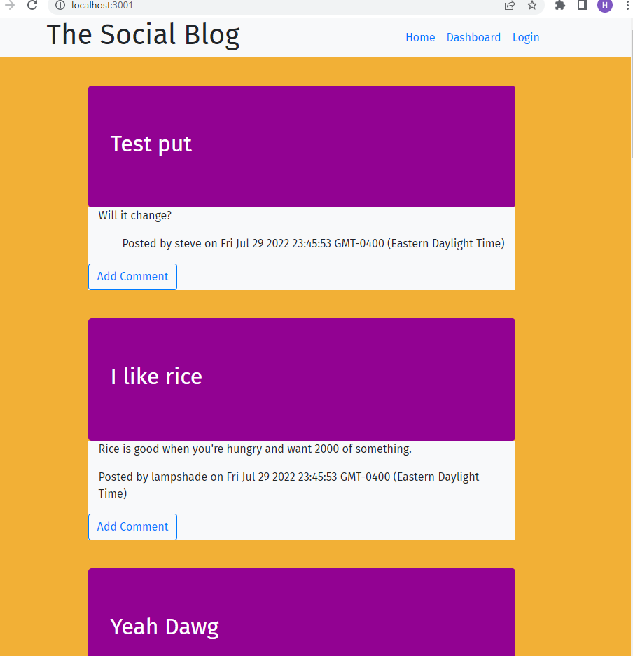

# Social Blog Website

## Table of Contents

- [Description](#description)
- [Installation](#installation)
- [Usage](#usage)
- [Contribution](#contribution)
- [Contact](#contact)

## Description

This is a simiple blog website that was made so that the author could practice making api routes in Express.js. It is a fully functioning blog with a frontend and backend. Users can register a profile, logout, log back in, create posts, edit posts, delete posts, and leave comments. It also logs a user out after five minutes of inactivity

## Installation

This program requires Node.js and NPM. Once these are installed, please run:

```
npm init -y
```
and

```
npm i
```

## Usage

This can be used as a templete for a basic blog site. It can then be customized to suit one's needs.


## Screenshot



## Contribution

You may contact me directly, and then fork the project. Anyone can contribute, but please provide credit to the original work.

## Questions

Feel free to reach out to me directly if you have any questions or concerns. You can reach me via email, or check out my github profile below.

Email: huntersteffner@gmail.com

GitHub: [huntersteffner](https://github.com/huntersteffner/)

## Future developments

Add validation functionality to ensure that input is in the expected format.
